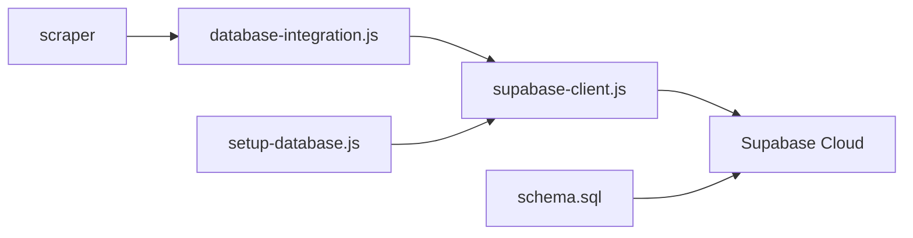

# 🗄️ Database - Estrutura e Arquivos

Esta pasta contém todos os arquivos relacionados à integração com o banco de dados Supabase.

## 📁 **Estrutura dos Arquivos**

### 🔧 **Core - Arquivos Principais**
- **`supabase-client.js`** - Cliente de conexão com Supabase
- **`database-integration.js`** - Camada de integração e CRUD operations
- **`setup-database.js`** - Script de configuração e teste inicial

### 🗃️ **Schema - Estrutura do Banco**
- **`schema.sql`** - Schema completo com todas as funcionalidades
- **`schema-minimo.sql`** - Schema simplificado para testes rápidos
- **`opcional-views-rls.sql`** - Configurações extras de segurança

### 📚 **Documentação**
- **`README.md`** - Guia técnico completo da integração
- **`SETUP-SUPABASE.md`** - Guia de configuração rápida (5 minutos)

## 🚀 **Como Usar**

### Setup Inicial
```bash
# 1. Configure suas credenciais no .env (raiz do projeto)
SUPABASE_URL=https://seu-projeto.supabase.co
SUPABASE_KEY=sua-chave-publica

# 2. Execute o setup
npm run db:setup

# 3. Execute o scraper com banco integrado
npm run scrape:full
```

### Arquivos de Schema

#### Para Produção (Recomendado)
Use `schema.sql` - contém todas as funcionalidades:
- ✅ Multi-tenant com RLS
- ✅ Triggers automáticos
- ✅ Views otimizadas
- ✅ Índices de performance
- ✅ Validações de dados

#### Para Testes Rápidos
Use `schema-minimo.sql` - apenas o essencial:
- ✅ Tabelas básicas
- ✅ Índices principais
- ⚠️ Sem RLS ou triggers

## 🔄 **Fluxo de Integração**



## 📊 **Comandos Úteis**

```bash
# Testar conexão
npm run db:setup

# Ver estatísticas
npm run db:stats

# Scraper completo
npm run scrape:full
```

## 🎯 **Guidelines de Organização**

### ✅ **Manter na pasta database/**
- Arquivos .sql (schemas, migrations)
- Arquivos de integração (cliente, CRUD)
- Scripts de setup e manutenção
- Documentação específica do BD
- Utilitários de banco

### ❌ **Não mover para database/**
- Arquivos .env (ficam na raiz)
- Configurações gerais do projeto
- Scripts principais de execução
- Documentação geral do projeto

---

**📍 Localização dos Arquivos Principais:**
- **Configuração**: `/.env` (raiz)
- **Execução**: `/main.js` (raiz)
- **Database**: `/database/*` (esta pasta)
- **Docs Gerais**: `/README.md` (raiz)
