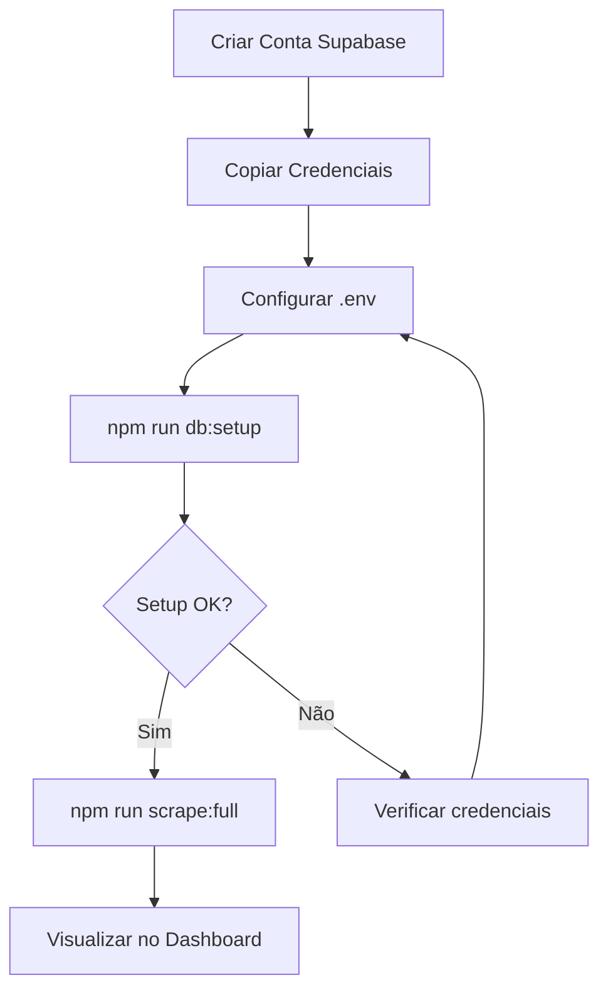

# 🚀 GUIA DE CONFIGURAÇÃO RÁPIDA - SUPABASE

## ⚡ Setup em 5 Minutos

### 1. **Criar Conta no Supabase**
```bash
# 1. Acesse: https://supabase.com
# 2. Clique em "Start your project"
# 3. Faça login com GitHub/Google
# 4. Clique em "New Project"
# 5. Escolha organização e nome do projeto
# 6. Aguarde 2-3 minutos para criação
```

### 2. **Obter Credenciais**
```bash
# No dashboard do seu projeto:
# 1. Vá em "Settings" (engrenagem)
# 2. Clique em "API"
# 3. Copie:
#    - Project URL
#    - anon/public key
```

### 3. **Configurar Ambiente**
```bash
# Edite o arquivo .env existente (já presente no projeto)
# Adicione suas credenciais do Supabase:
SUPABASE_URL=https://[seu-projeto].supabase.co
SUPABASE_KEY=[sua-chave-publica]
```

### 4. **Instalar Dependências (se necessário)**
```bash
npm install @supabase/supabase-js
```

### 5. **Executar Setup**
```bash
# Opção 1: Setup manual do banco
npm run db:setup

# Opção 2: Execução completa (setup + scraping)
npm run scrape:full
```

---

## 🗃️ Criação do Schema (Primeira Vez)

### Manual (Recomendado)
1. **Acesse o Dashboard**: https://app.supabase.com
2. **Vá para seu projeto**
3. **Clique em "SQL Editor"** (no menu lateral)
4. **Cole todo o conteúdo** do arquivo `database/schema.sql`
5. **Clique em "Run"**
6. **Aguarde confirmação**: "Success. No rows returned"

### Via Dashboard
1. **Table Editor** → **Create a new table**
2. **Nome**: `produtos`
3. **Adicione as colunas** conforme schema.sql
4. **Repita para**: `metricas_scraping` e `campanhas`

---

## ✅ Verificação Rápida

### Teste de Conexão
```bash
npm run db:setup
```

**Resultado esperado:**
```
🚀 Iniciando setup do banco de dados Supabase...
1️⃣ Testando conexão com Supabase...
✅ Conexão com Supabase estabelecida!
2️⃣ Verificando estrutura do banco...
   Tabelas encontradas: produtos, metricas_scraping, campanhas
🎉 SETUP CONCLUÍDO COM SUCESSO!
```

### Teste de Dados
```bash
npm run db:stats
```

**Resultado esperado:**
```json
{
  "totalProdutos": 0,
  "totalMetricas": 0,
  "totalCampanhas": 0,
  "categoriaMaisPopular": null,
  "scoreMedia": null
}
```

---

## 🚨 Problemas Comuns

### ❌ "Invalid API key"
```bash
# Verificar se a chave está correta no .env
# Usar a anon/public key, NÃO a service_role
```

### ❌ "Connection refused"
```bash
# Verificar se a URL está correta no .env
# Formato: https://[projeto].supabase.co (sem barra no final)
```

### ❌ "Tabelas não encontradas"
```bash
# Execute o schema SQL manualmente no Dashboard
# SQL Editor → Cole schema.sql → Run
```

### ❌ "RLS (Row Level Security) error"
```bash
# O schema.sql já configura as políticas
# Se persistir, desative temporariamente:
# ALTER TABLE produtos DISABLE ROW LEVEL SECURITY;
```

---

## 🎯 Comandos Úteis

```bash
# Setup completo do banco
npm run db:setup

# Executar scraper com banco
npm run scrape:full

# Ver estatísticas do banco
npm run db:stats

# Scraper tradicional (sem banco)
npm run scrape

# Apenas iniciar scraper
npm start
```

---

## 📊 Visualização dos Dados

### No Supabase Dashboard
1. **Table Editor** → **produtos**
2. **Filtros disponíveis**:
   - Por categoria
   - Por score
   - Por data
3. **Ordenação**: Score total (decrescente)

### Queries SQL Úteis
```sql
-- Top 10 produtos
SELECT nome, categoria, score_total 
FROM produtos 
ORDER BY score_total DESC 
LIMIT 10;

-- Resumo por categoria
SELECT categoria, COUNT(*), AVG(score_total)
FROM produtos 
GROUP BY categoria;

-- Produtos de hoje
SELECT * FROM produtos 
WHERE DATE(criado_em) = CURRENT_DATE;
```

---

## 🔄 Fluxo Completo



---

## 🎉 Pronto!

Após o setup, execute:
```bash
npm run scrape:full
```

E acompanhe os dados chegando em tempo real no Dashboard do Supabase!

**Dashboard URL**: https://app.supabase.com/project/[seu-projeto]
